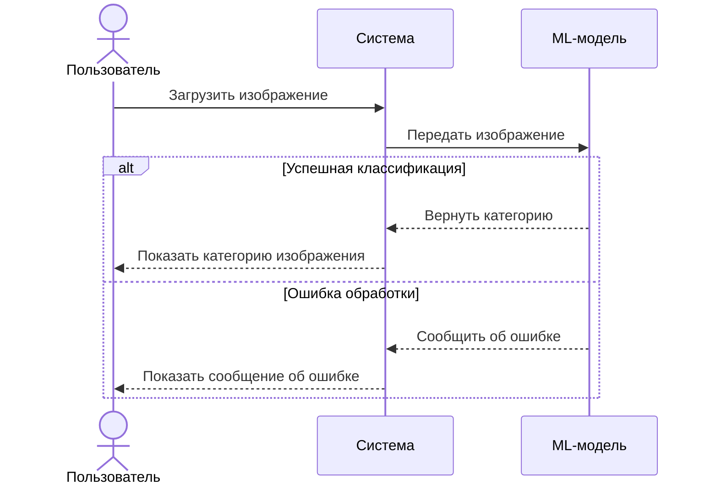
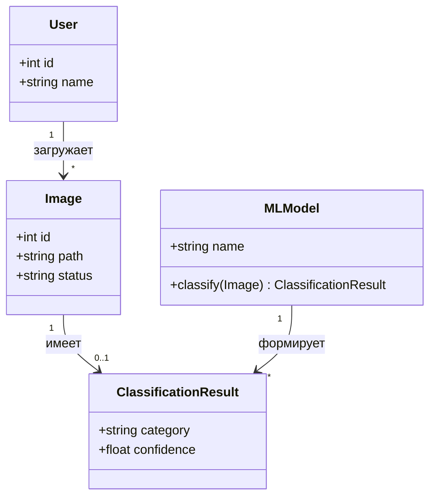

# Диаграммы

## Диаграммы последовательностей

### UC-01. Отправка изображения на классификацию

```mermaid
sequenceDiagram
    actor User as Пользователь
    participant System as Система
    participant Model as ML-модель

    User->>System: Загрузить изображение
    System->>Model: Передать изображение

    alt Успешная классификация
        Model-->>System: Вернуть категорию
        System-->>User: Показать категорию изображения
    else Ошибка обработки
        Model-->>System: Сообщить об ошибке
        System-->>User: Показать сообщение об ошибке
    end
```

## Диаграммы классов

### UC-01. Отправка изображения на классификацию

```mermaid
classDiagram
    class User {
        +int id
        +string name
    }

    class Image {
        +int id
        +string path
        +string status
    }

    class ClassificationResult {
        +string category
        +float confidence
    }

    class MLModel {
        +string name
        +classify(Image) ClassificationResult
    }

    User "1" --> "*" Image : загружает
    Image "1" --> "0..1" ClassificationResult : имеет
    MLModel "1" --> "*" ClassificationResult : формирует
```